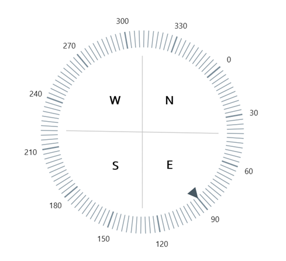

# How-to-create-the-directional-compass-using-the-.NET-MAUI-Radial-Gauge
This article describes how to create the directional compass using the [Syncfusion .NET MAUI Radial Gauge](https://www.syncfusion.com/maui-controls/maui-radial-gauge) control.

**Step 1:** Create the [SfRadialGauge](https://help.syncfusion.com/cr/maui/Syncfusion.Maui.Gauges.SfRadialGauge.html) control by referring to this getting started [link](https://help.syncfusion.com/maui/radialgauge/getting-started#creating-an-application-using-the-net-maui-radial-gauge). Set the [StartAngle](https://help.syncfusion.com/cr/maui/Syncfusion.Maui.Gauges.RadialAxis.html#Syncfusion_Maui_Gauges_RadialAxis_StartAngle) and [EndAngle](https://help.syncfusion.com/cr/maui/Syncfusion.Maui.Gauges.RadialAxis.html#Syncfusion_Maui_Gauges_RadialAxis_EndAngle) of [RadialAxis](https://help.syncfusion.com/cr/maui/Syncfusion.Maui.Gauges.RadialAxis.html) as 320 to heading the North value as 0 and get the full circular axis.

[C#]
```
<gauge:SfRadialGauge>
        <gauge:SfRadialGauge.Axes>
            <gauge:RadialAxis … >
               …
                <gauge:RadialAxis.BackgroundContent>
                    <Image Source="dark_theme_gauge.png"/>
                </gauge:RadialAxis.BackgroundContent>
            </gauge:RadialAxis>
        </gauge:SfRadialGauge.Axes>
 </gauge:SfRadialGauge>
```

**Step 2:** Set the [Minimum](https://help.syncfusion.com/cr/maui/Syncfusion.Maui.Gauges.RadialAxis.html#Syncfusion_Maui_Gauges_RadialAxis_Minimum) and [Maximum](https://help.syncfusion.com/cr/maui/Syncfusion.Maui.Gauges.RadialAxis.html#Syncfusion_Maui_Gauges_RadialAxis_Maximum) of the radial axis as 0 and 360, respectively, and the [Interval](https://help.syncfusion.com/cr/maui/Syncfusion.Maui.Gauges.RadialAxis.html#Syncfusion_Maui_Gauges_RadialAxis_Interval) as 30 to display eight direction values in the radial axis.

[XAML]
```
<gauge:SfRadialGauge>
    <gauge:SfRadialGauge.Axes>
        <gauge:RadialAxis Minimum="0"
                          Maximum="360"
                          Interval="30" … >
            …
        </gauge:RadialAxis>
    </gauge:SfRadialGauge.Axes>
</gauge:SfRadialGauge>
```

**Step 3:** To customize the major and minor ticks, you can use the [MajorTickStyle](https://help.syncfusion.com/cr/maui/Syncfusion.Maui.Gauges.RadialAxis.html#Syncfusion_Maui_Gauges_RadialAxis_MajorTickStyle) and [MinorTickStyle](https://help.syncfusion.com/cr/maui/Syncfusion.Maui.Gauges.RadialAxis.html#Syncfusion_Maui_Gauges_RadialAxis_MinorTickStyle) as shown in the following code sample.

[XAML]
```
<gauge:RadialAxis.MinorTickStyle>
    <gauge:RadialTickStyle LengthUnit="Factor"
                           Length="0.12" />
</gauge:RadialAxis.MinorTickStyle>
<gauge:RadialAxis.MajorTickStyle>
    <gauge:RadialTickStyle StrokeThickness="2" … />
</gauge:RadialAxis.MajorTickStyle>
```

**Step 4:** Add two [Needle Pointers](https://help.syncfusion.com/cr/maui/Syncfusion.Maui.Gauges.NeedlePointer.html) to divide the gauge into four parts: north, east, south, and west.

[XAML]
```
<gauge:RadialAxis.Pointers>
    …
    <gauge:NeedlePointer Value="310"
                         NeedleLengthUnit="Factor"
                         NeedleLength="0.9"
                         NeedleStartWidth="1"
                         NeedleEndWidth="1"
                         NeedleFill="#FFC4C4C4"
                         KnobRadius="0"
                         TailLengthUnit="Factor"
                         TailLength="0.9"
                         TailWidth="1"
                         TailFill="#FFC4C4C4">
    </gauge:NeedlePointer>
    <gauge:NeedlePointer Value="221" … >
    </gauge:NeedlePointer>
</gauge:RadialAxis.Pointers>
```

**Step 5:** To denote the directions, you can use [Annotations](https://help.syncfusion.com/cr/maui/Syncfusion.Maui.Gauges.GaugeAnnotation.html) as shown in the following code sample.

[XAML]
```
<gauge:RadialAxis.Annotations>
    <gauge:GaugeAnnotation DirectionValue="230"
                           PositionFactor="0.5">
        <gauge:GaugeAnnotation.Content>
            <Label Text="W"
                   FontAttributes="Bold"
                   FontSize="18"
                   TextColor="Black" />
        </gauge:GaugeAnnotation.Content>
    </gauge:GaugeAnnotation>
    <gauge:GaugeAnnotation DirectionValue="310" …>
        …
    </gauge:GaugeAnnotation>
    <gauge:GaugeAnnotation DirectionValue="129"…>
        …
    </gauge:GaugeAnnotation>
    <gauge:GaugeAnnotation DirectionValue="50" …>
        …
    </gauge:GaugeAnnotation>
</gauge:RadialAxis.Annotations>
```

**Step 6:** Add a shape pointer to indicate the direction as follows.

[XAML]
```
<gauge:RadialAxis.Pointers>
    <gauge:ShapePointer Value="90"
                        ShapeType="Triangle" />
    …
</gauge:RadialAxis.Pointers>
```

[Output]



## See also

[How to create an application using the .NET MAUI Radial Gauge?](https://help.syncfusion.com/maui/radialgauge/getting-started#creating-an-application-using-the-net-maui-radial-gauge)

[How to customize Axis?](https://help.syncfusion.com/maui/radialgauge/axes#axis-customization)

[How to customize Axis Label?](https://help.syncfusion.com/maui/radialgauge/axes?cs-save-lang=1&cs-lang=csharp#axis-label-customization)

[How to customize Axis Label using Label Created Event?](https://help.syncfusion.com/maui/radialgauge/axes?cs-save-lang=1&cs-lang=csharp#labelcreated)

[How to customize Ticks?](https://help.syncfusion.com/maui/radialgauge/axes?cs-save-lang=1&cs-lang=csharp#tick-customization)

[How to customize the Needle pointer?](https://help.syncfusion.com/maui/radialgauge/needle-pointer#needle-customization)

[How to position and customize annotation?](https://help.syncfusion.com/maui/radialgauge/annotation)
